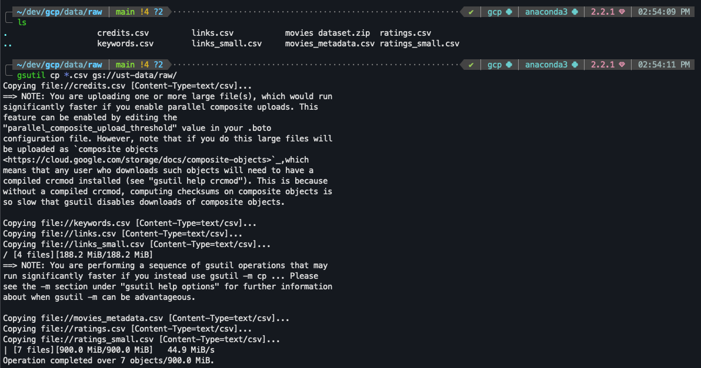
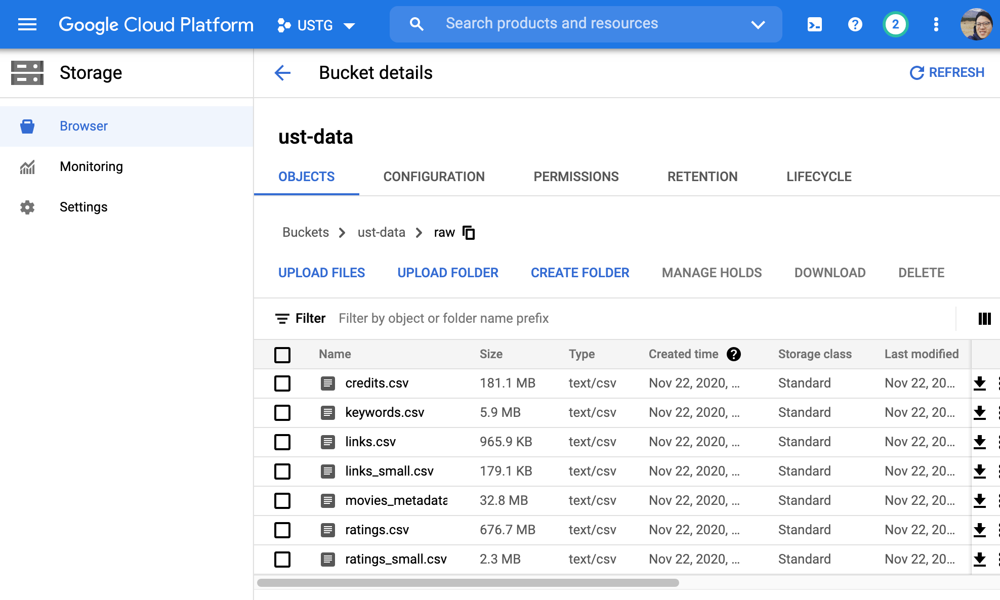
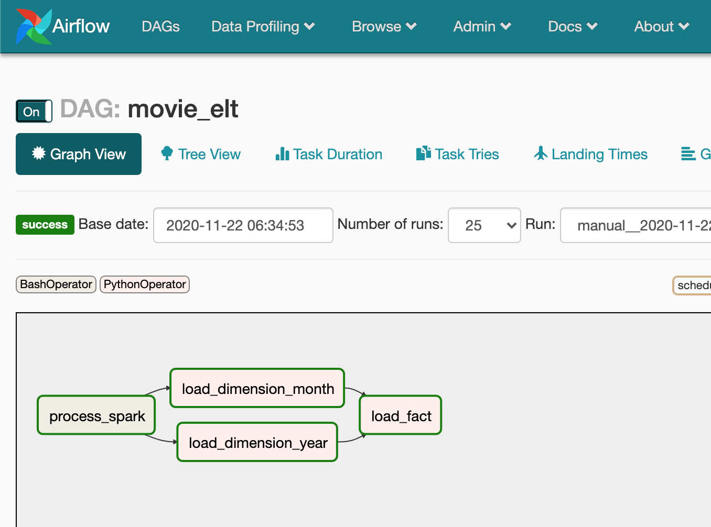
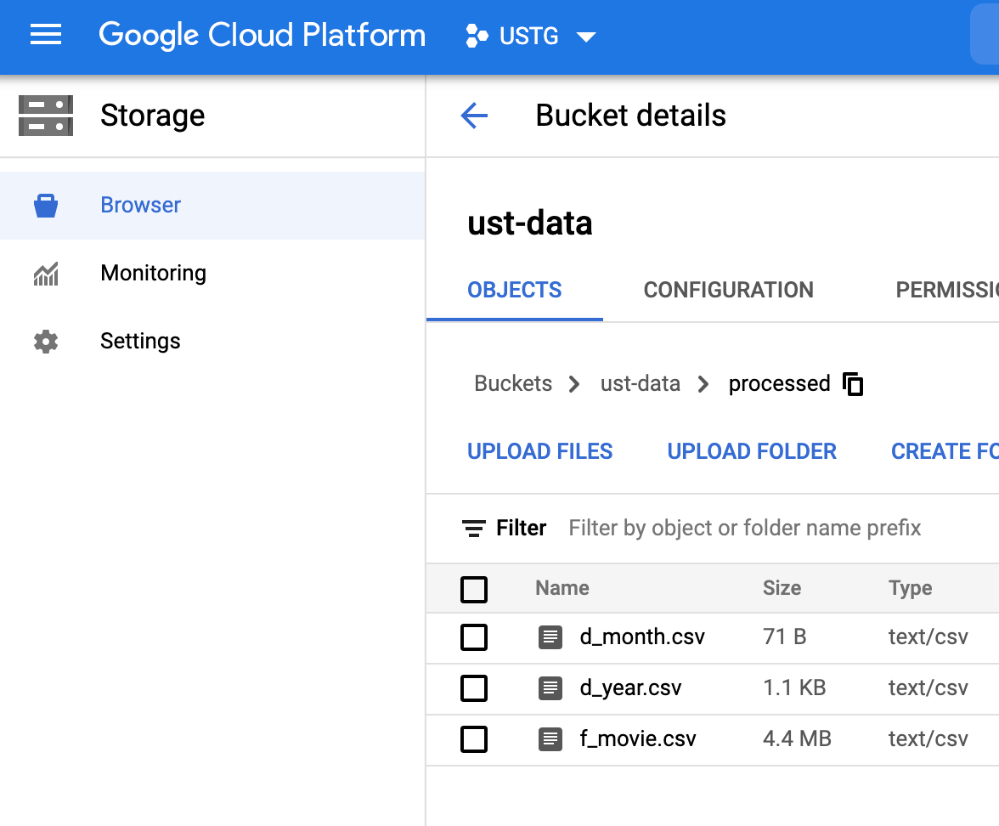
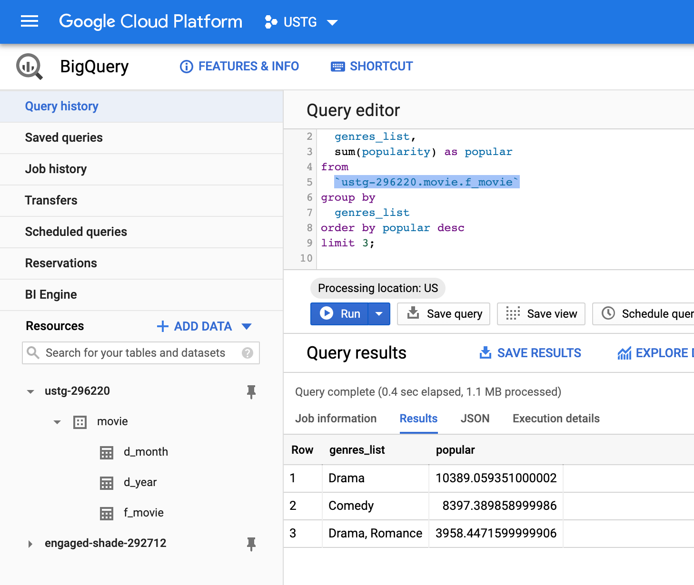
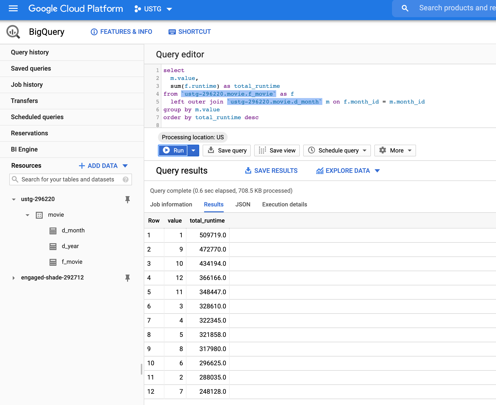
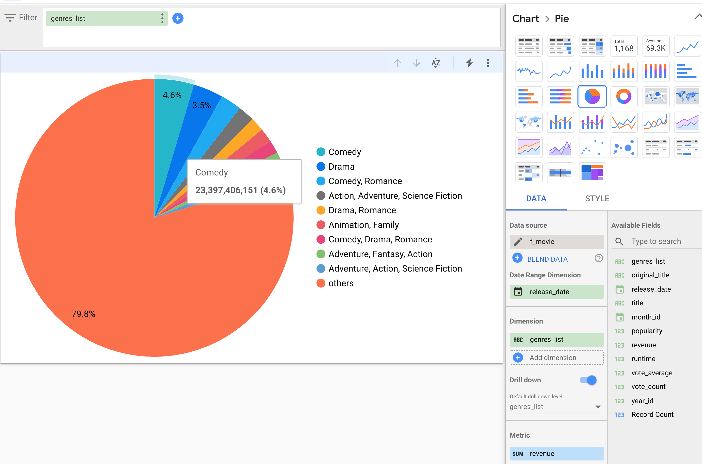

# UST Global Digital COE hallenge

## Objectives

The solution should minimally demonstrate the following:

- Deploy data engineering solution any cloud (AWS,GCP,Azure,etc)
- Design data model for data warehouse
- Demonstrate ingestion & storage of raw data in any data lake
- Demonstrate ETL data pipelines deployments using any cloud service and programming choice
- Demonstrate orchestration pipeline deployment using any cloud service or orchestration tool (i.e Airflow)
- Store transformed data in a cloud data warehouse of any choice
- Demonstrate querying and answering of questions against data warehouse

## Cloud Solution

- Choosen GCP
- Components Used:
  - Storage Bucket
  - DataProc (Spark)
  - Composer (Airflow)
  - BigQuery
  - DataStudio
- Data Flow
  - Storage > DataProc (Orchestrate by Airflow) > BigQuery

### Storage (Raw Data)

- Upload Data to GCP Storage
- Unable to find out the direct download URL so did not include this step in Airflow.

### Data Model for Data Warehouse

- Cater only to answer business question, did not design full scale tables for every raw input
- Create minimum dimension tables `d_year`, `d_month` for fact table `f_movie`

### ETL Pipeline

- Choose Spark as ETL Tool.
- Output the fact and dimension data files and store in bucket. See `process.py`.
- Load dimensions and fact data into BigQuery Table. See `process_data_dag.py`
- Airflow DAG. See `process_data_dag.py`

## Business Question

- What is the most popular movie?

> Based on the voter data, ***Inception*** is the most popular movie.

- Which type of movies are most watched?

> Based on the pouplarity metric provided by the data. ***Drama*** is the types of movie most popular.

- Which time of the year have the most movie-goers?

> Jan, Sep, Oct are the months have the most movie-goers. (Based on `Runtime`)

- Any other business insights

> It seems ***Comedy*** is the type of genere generate the most revenue

